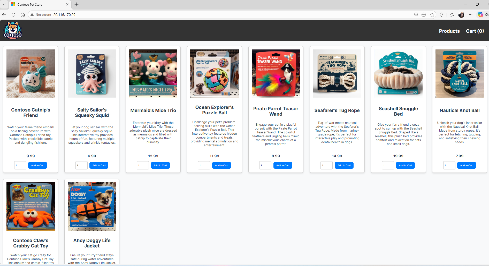

CST8918 - DevOps: Infrastructure as Code \
Student: Olga Durham \
St#: 040687883  

# Hybrid-H09 Azure Kubernetes Service (AKS) Cluster with Terraform

---

## Overview

This lab demonstrates how to provision an Azure Kubernetes Service (AKS) cluster using Terraform and deploy a sample microservices application using Kubernetes.

---

## Infrastructure Deployment

Initialize Terraform

```
terraform init
```

Validate Configuration

```
terraform validate
```

Apply Configuration

```
terraform apply
```

---

## Kubernetes Configuration

Export kubeconfig

```
terraform output -raw kube_config > kubeconfig
```

Set environment variable (PowerShell)

```
$env:KUBECONFIG = "$PWD\kubeconfig"
```

Verify cluster connection

```
kubectl get nodes
```

---

## Application Deployment

Deploy sample application

```
kubectl apply -f sample-app.yaml
```

Verify deployment

```
kubectl get pods
kubectl get services
```

---

## Application Access

The application is exposed using a Kubernetes LoadBalancer service.

Access the application in a browser using the external IP:

```
http://20.116.170.29
```

---

## Screenshot

Below is a screenshot of the running application:



---

## Cleanup

To avoid unnecessary Azure charges, the resources were destroyed after testing:

```
terraform destroy
```

---

## Files Included

- providers.tf
- main.tf
- variables.tf
- outputs.tf
- sample-app.yaml
- README.md

---

## Result

The AKS cluster was successfully deployed using Terraform with autoscaling enabled (1–3 nodes, Standard_B2s VM size).

The Kubernetes cluster was accessed using `kubectl`, and the sample microservices application (RabbitMQ, order-service, product-service, and store-front) was deployed successfully.

All pods reached the **Running** state, and the application was accessible via an external LoadBalancer IP.

---

## Notes

- AKS cluster uses SystemAssigned managed identity
- Node pool uses Virtual Machine Scale Sets with autoscaling enabled
- Kubernetes version was automatically selected (latest available)
